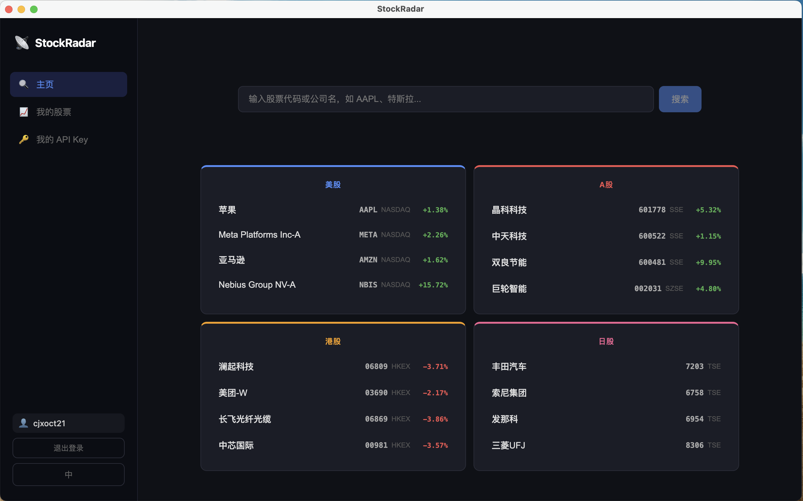
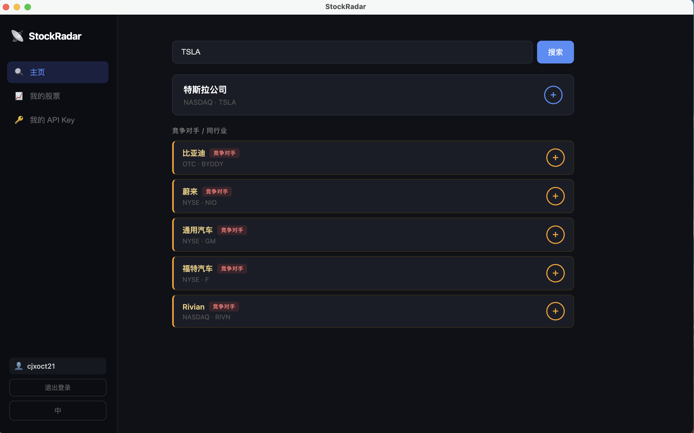
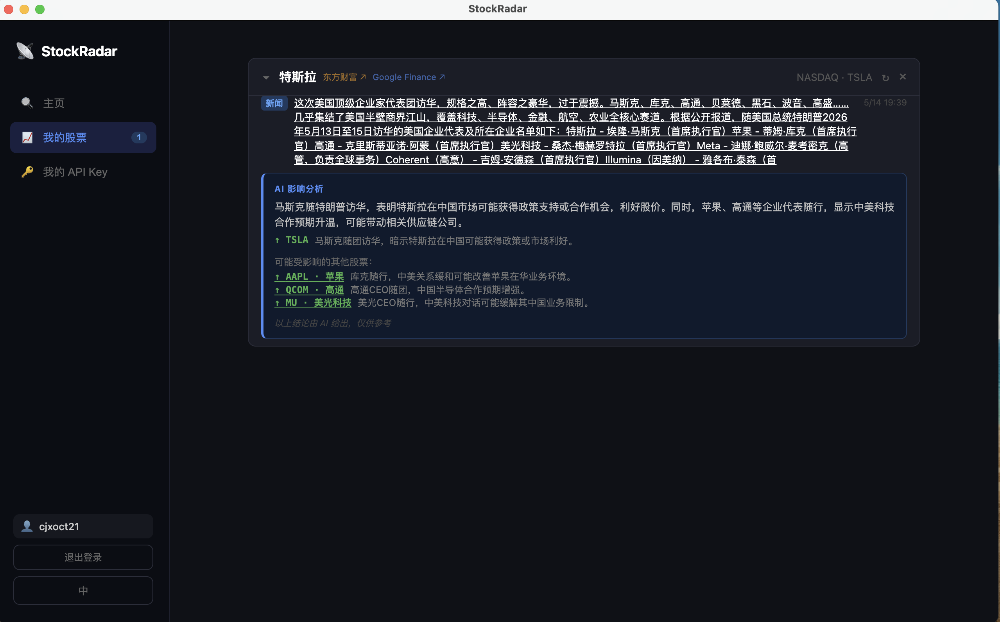

# StockRadar 📡





---

## 中文

个人股票情报追踪工具。输入股票代码或公司名，自动抓取微博、Google News 等平台的最新动态，并用 AI 分析每条内容对股价的潜在影响。

### 功能
- 输入股票代码或公司名（支持中文 / 英文 / 日语）→ AI 自动识别，返回基本信息 + 竞争对手
- 保存股票后自动爬取微博、Twitter、Google News 等平台动态
- DeepSeek AI 分析每条内容是否影响股价，给出涨跌结论和可能受波及的其他股票
- 首页热门推荐：东方财富实时热榜（A股 / 港股 / 美股 / 日股）
- 多账号系统，每个账号独立管理关注列表和 API Key
- 界面支持中文 / English / 日本語

### 使用前准备
需要一个 **DeepSeek API Key**，在 [platform.deepseek.com](https://platform.deepseek.com) 免费注册后获取，费用极低（每次搜索 < ¥0.01）。首次启动后在界面内填入即可。

### Mac 安装
| 文件 | 适用机型 |
|------|----------|
| `StockRadar-0.1.0-arm64.dmg` | Apple Silicon（M1 / M2 / M3） |
| `StockRadar-0.1.0.dmg` | Intel 芯片 |

下载对应文件，双击打开，将应用拖入 Applications 文件夹。

> ⚠️ 由于未经 Apple 签名，首次打开时 macOS 会提示"无法验证开发者"。请前往**系统设置 → 隐私与安全性**，点击「仍要打开」即可。

### Windows 构建（需要开发环境）
前置要求：Python 3.9+、Node.js 18+、pip、npm

```bash
# 在 Windows 上克隆源码仓库后，进入 stockradar 目录运行：
build-win.bat
# 完成后安装包生成在 frontend\dist-electron\StockRadar Setup 0.1.0.exe
```

也可以直接下载本仓库中的 `build-win.bat`，放到源码的 `stockradar/` 目录下运行。

---

## English

A personal stock intelligence tracker. Enter a ticker or company name to automatically fetch the latest updates from Weibo, Google News, and more — with AI analysis of each item's potential impact on stock prices.

### Features
- Enter a ticker or company name (Chinese / English / Japanese) → AI identifies the stock and returns basic info + competitors
- Automatically crawls Weibo, Twitter, Google News after you save a stock
- DeepSeek AI analyzes each item for stock price impact, with direction (up/down) and affected stocks
- Home page trending picks powered by EastMoney live rankings (US / HK / A-share / Japan)
- Multi-account system with per-user watchlists and API keys
- UI available in 中文 / English / 日本語

### Before You Start
You need a **DeepSeek API Key** — sign up for free at [platform.deepseek.com](https://platform.deepseek.com). Cost is minimal (< ¥0.01 per search). Enter it in the app on first launch.

### Mac Installation
| File | Target |
|------|--------|
| `StockRadar-0.1.0-arm64.dmg` | Apple Silicon (M1 / M2 / M3) |
| `StockRadar-0.1.0.dmg` | Intel |

Download the appropriate file, open it, and drag the app into your Applications folder.

> ⚠️ Because the app is not signed with an Apple Developer certificate, macOS may show "cannot verify developer." Go to **System Settings → Privacy & Security** and click "Open Anyway."

### Windows Build (requires dev environment)
Prerequisites: Python 3.9+, Node.js 18+, pip, npm

```bash
# Clone the source repo, go to the stockradar/ directory, then run:
build-win.bat
# Output: frontend\dist-electron\StockRadar Setup 0.1.0.exe
```

---

## 日本語

個人向け株式情報トラッカーです。ティッカーや会社名を入力すると、微博・Google News などから最新情報を自動取得し、AI が各記事の株価への影響を分析します。

### 機能
- ティッカーまたは会社名（中国語 / 英語 / 日本語）を入力 → AI が自動識別し、基本情報と競合他社を返す
- 株式を保存すると微博・Twitter・Google News などから動向を自動クロール
- DeepSeek AI が各記事の株価影響を分析し、上昇 / 下落の方向と影響を受ける可能性のある他の銘柄を表示
- ホーム画面に東方財富リアルタイム人気ランキング（米国株 / 香港株 / A株 / 日本株）
- マルチアカウント対応、ウォッチリストと API Key はアカウントごとに独立管理
- 中文 / English / 日本語 の三言語 UI

### 事前準備
**DeepSeek API Key** が必要です。[platform.deepseek.com](https://platform.deepseek.com) で無料登録後に取得できます。費用はわずかです（1回の検索 < ¥0.01）。アプリ初回起動時に画面内で入力してください。

### Mac インストール
| ファイル | 対象機種 |
|----------|----------|
| `StockRadar-0.1.0-arm64.dmg` | Apple Silicon（M1 / M2 / M3） |
| `StockRadar-0.1.0.dmg` | Intel チップ |

該当ファイルをダウンロードし、開いてアプリを Applications フォルダにドラッグしてください。

> ⚠️ Apple 開発者署名がないため、初回起動時に「開発元を確認できません」と表示されることがあります。**システム設定 → プライバシーとセキュリティ**から「このまま開く」をクリックしてください。

### Windows ビルド（開発環境が必要）
前提条件：Python 3.9+、Node.js 18+、pip、npm

```bash
# ソースコードをクローン後、stockradar/ ディレクトリで実行：
build-win.bat
# 完了後、インストーラーは frontend\dist-electron\StockRadar Setup 0.1.0.exe に生成されます
```

---

## Source Code

[github.com/xingOct21/StockRadar](https://github.com/xingOct21/StockRadar)
